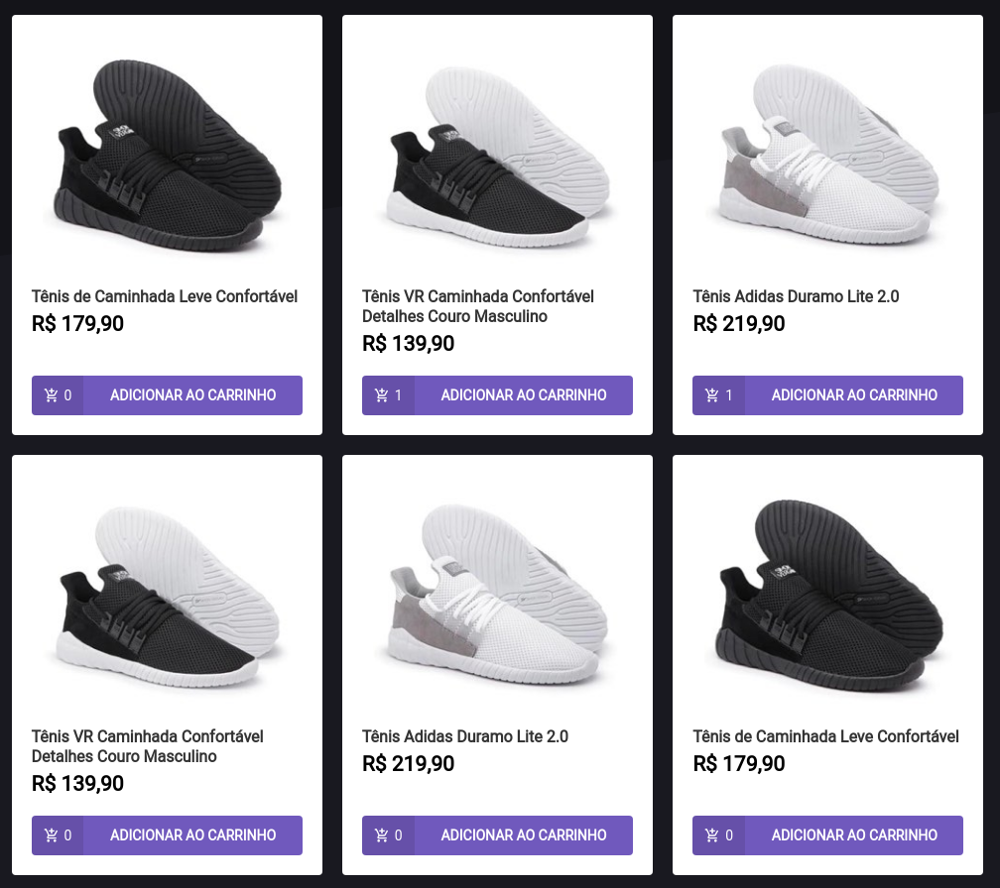

<h1 align="center"> Ignite ReactJS </h1>
<h2 align="center"> Desafio 03 : Criando um hook de carrinho de compras </h2>
<p align="center">
  <a href="https://rocketseat.com.br">
    
  </a>
    <a href="https://www.linkedin.com/in/thiagonovaess/">
    
  </a>
</p>

## 🚀 Sobre o Projeto

Aplicação onde o principal objetivo é a criação de um hook de carrinho de compras. Com as seguintes funcionalidades:

- Adicionar um novo produto ao carrinho;
- Remover um produto do carrinho;
- Alterar a quantidade de um produto no carrinho;
- Cálculo dos preços sub-total e total do carrinho;
- Validação de estoque;
- Exibição de mensagens de erro com o toastify;
- Entre outros.

Os dados da aplicação serão simulados utilizando o Fake API com JSON Server e os dados do carrinho de compras serão persistidos no localStorage no navegador.

## ⚙️ Rodando o Projeto

```bash
# Abra um terminal e copie este repositório com o comando
git clone https://github.com/nsthiago/reactjs-challenge-03
# ou use a opção de download.

# Entre na pasta da aplicação 
# Instale as dependências
yarn install

# Inicie a Fake API
yarn server

# Rode a aplicação
yarn start

# Acesse http://localhost:3000 no seu navagador
```

## Screens
<div align="center">
    
   </br>
</div>

<div align="center">
    
   </br>
</div>
